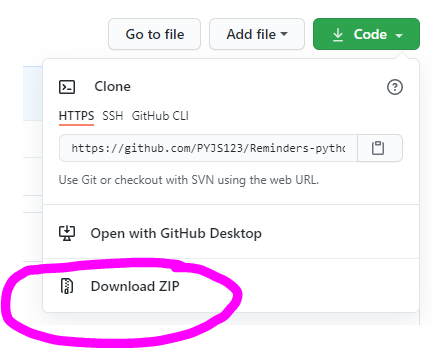
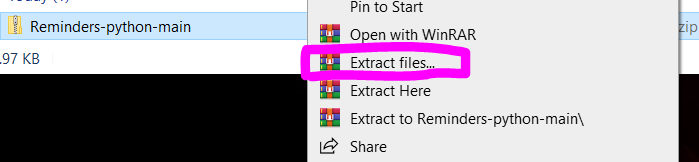
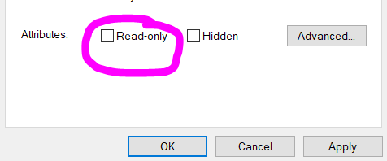
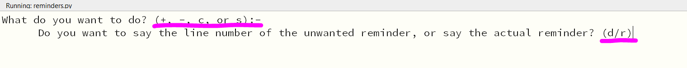

# Reminders-python
A way to keep your reminders stored crudely in a text file in a way that could cause some serious errors.
<button><a href="Reminders-python-main.zip" download>Download</a></button>

## STEPS TO DOWNLOAD:
1. Download repository 

2. Extract to any location

3. Make sure all directories leading to the files are not 'read-only' by following these instructions on each file and directory to them (for Windows and every other OS for all I know):
   1. Right-click the file/directory
   2. Click 'Properties'
   3. Un-check the 'Read-only' box
   4. Do all the bla-dee-bla it tells you to do
   5. Click 'Apply' and 'OK'

4. Open the python file and have a nice day using the world's most to-the-metal version of a reminder-keeper (?).

## More information about the actual program:
1. When prompted 'What do you want to do? (+, -, c, or s):', + is for adding reminders, - for deleting them, c for clearing all reminders, and s for showing the current reminders.
2. When asked whether you want to delete reminders by line number or the actual, raw form of the reminder (as in string form, if that was confusing), d is for inputting line number and r is for the raw form.

